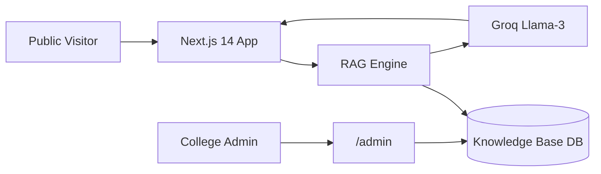
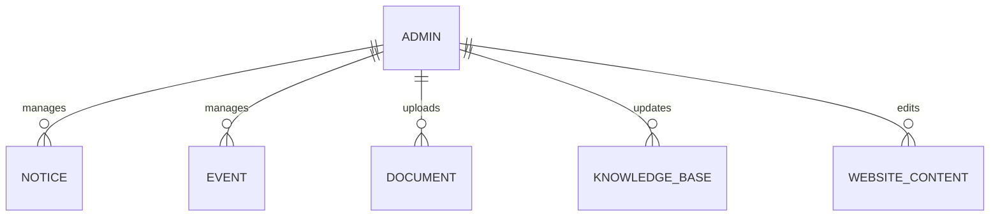

# FINAL VIVA PRESENTATION SLIDES

# Project Title: VDCET Official Website with AI-Powered RAG Knowledge Assistant

---

## SLIDE 1: Title Slide
* **Project Title**: VDCET Official Website with AI-Powered RAG Knowledge Assistant
* **Student Lead**: Suraj Gajanan Pathade
* **Team Members**: Suraj Gajanan Pathade, Rohit Shirbhate, Khushal Hajare, Harshal Kalbhut, Sanket Nasare, Tejas Sawargaokar
* **Guide**: Rohini Ma’am
* **Department**: Computer Engineering Department
* **College**: Vilasrao Deshmukh College of Engineering & Technology, Mouda (VDCET)
* **University**: Dr. Babasaheb Ambedkar Technological University (DBATU), Lonere
* **Academic Session**: 2026–2027

---

## SLIDE 2: Introduction
* **VDCET Mouda**: AICTE approved, DTE Maharashtra Institute Code **04141**.
* **Problem**: Traditional college websites are crowded, slow on mobile, and lack instant search.
* **Solution**: A modern, minimal, Apple-style web portal integrated with a RAG AI Assistant and hidden CMS.

---

## SLIDE 3: Problem Statement
* Information spread across unorganized sub-pages.
* Prospective CAP candidates need fast answers regarding eligibility, required documents, and institute code 04141.
* Standard AI chatbots hallucinate unverified dates, fees, and faculty names.

---

## SLIDE 4: Existing System vs. Proposed System
* **Existing**: Static pages, visual clutter, manual query processing via phone/office visits.
* **Proposed**: Minimal Apple-style layout, mobile-first performance, grounded RAG AI assistant with source tags, hidden secure `/admin` CMS.

---

## SLIDE 5: Objectives
1. Build an Apple-style, responsive official website.
2. Integrate an AI RAG Assistant grounded strictly in verified VDCET facts.
3. Provide source attribution badges and strict fallback messages for unfound queries.
4. Implement secret route `/admin` for notice, event, and document management.
5. Donate completed website to VDCET.

---

## SLIDE 6: System Architecture Diagram

---

## SLIDE 7: Technology Stack Overview
* **Frontend**: Next.js 14 (App Router), TypeScript, Tailwind CSS, Lucide React
* **Backend**: Next.js API Routes & Server Actions
* **Database**: Modular Repository Layer (`vdcet-db.json` / SQLite)
* **Security**: HTTP-only JWT Cookies (`jsonwebtoken`), Password Authentication
* **AI Engine**: Groq SDK (`groq-sdk` Llama-3-8B-Instant) + Relevance Scoring Engine

---

## SLIDE 8: RAG Knowledge Retrieval Pipeline
1. Visitor submits query on `/ai-assistant`.
2. System calculates relevance score against knowledge chunks.
3. Top relevant chunks injected into system prompt.
4. LLM generates grounded answer.
5. UI displays answer + official source badges.
6. Fallback message shown if no matching chunk found.

---

## SLIDE 9: Public Website Layout & Structure
* **8 Core Sections on Homepage**: Hero → Programs → About → Latest Notices → Campus → AI Assistant → Contact → Footer.
* **Public Pages**: `/`, `/about`, `/academics`, `/admissions`, `/campus`, `/notices`, `/contact`, `/ai-assistant`.
* Zero public login/signup clutter.

---

## SLIDE 10: Academic Programs (DTE Code: 04141)
1. **Computer Engineering (CSE)**
2. **Artificial Intelligence & Data Science (AI & DS)**
3. **Civil Engineering (CIVIL)**
4. **Mechanical Engineering (MECH)**

---

## SLIDE 11: Admissions & Document Verification
* **CAP Guidelines**: Step-by-step Maharashtra CET option form instructions using Institute Code 04141.
* **Checklist**: HSC/SSC Marksheets, Allotment Letter, Leaving Certificate, Caste/Validity/Domicile/Income certificates.

---

## SLIDE 12: Entity-Relationship (ER) Diagram

---

## SLIDE 13: Hidden Admin CMS (`/admin`)
* Secret route `/admin` with zero public links.
* Protected by HTTP-only JWT session cookies.
* Management Tabs: Notices, Events, Documents, AI Knowledge Base, Website Content/Contacts.
* Status Controls: `Draft`, `Published`, `Archived`.

---

## SLIDE 14: AI Assistant Live Demonstration Flow
* **Sample Query**: *"What B.Tech programs are available?"*
* **Response**: Lists CSE, AI&DS, Civil, and Mechanical branches.
* **Source Badge**: `[Source: DTE Approved Course List]`.
* **Unfound Query**: *"Who is president of Mars?"*
* **Fallback Response**: *"I couldn't find this information in the official VDCET knowledge base. Please contact the college office."*

---

## SLIDE 15: Empirical Testing Results
* **Type Check**: 0 Errors (`npx tsc --noEmit`)
* **Production Build**: Compiled Successfully (`npm run build`)
* **Route Test**: All 9 routes returned HTTP 200 OK
* **Admin Security Test**: Invalid password returned 401 Unauthorized; Valid password set JWT cookie.

---

## SLIDE 16: Security & Privacy Features
* Admin route hidden from public navigation.
* JWT authentication for all `/api/admin/*` routes.
* API keys stored in server-side environment variables.

---

## SLIDE 17: Future Scope
* Multilingual support (Marathi & Hindi AI responses).
* Voice query input.
* Automatic PDF circular text extraction into knowledge base.

---

## SLIDE 18: Conclusion & Thank You
* Project successfully delivers a modern website, grounded AI assistant, and hidden CMS.
* Ready for donation to Vilasrao Deshmukh College of Engineering & Technology, Mouda.
* **Thank You! Questions & Discussion.**
